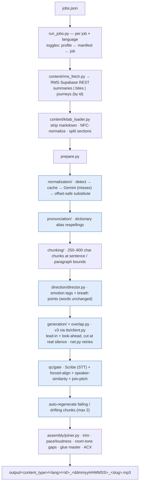

# ElevenLabs v3 audiobook narration pipeline

Turns Kitab content (pulled from the RMS database) into mastered audiobook narration with
ElevenLabs **eleven_v3**, in English and Hindi. It handles the two hard parts of long-form v3:
**voice consistency** across many separately-generated chunks, and **near-zero errors**
(no skipped/repeated words, hallucinated sounds, mispronunciations, or audible seams).

Design reasoning and the research behind each decision: [PLAN.md](PLAN.md), [RESEARCH.md](RESEARCH.md).

---

## Architecture



Blue nodes are the switchable checkpoints (see **Controlling the pipeline**):
`normalize` (N) · `pronunciation` (PR) · `direction` (D) · `overlap` (G) ·
`qc_assess` (Q) · `qc_fix` (X). Everything intermediate lives in `work/<slug>/<lang>/`;
only the final mp3 is copied to `output/`.

---

## Setup

```bash
python3 -m venv .venv
.venv/bin/pip install -r requirements.txt          # + ffmpeg/ffprobe on PATH (rubberband, loudnorm, deesser)
cp .env.example .env                               # then fill in the real keys
```
`.env` needs: `ELEVEN_LABS_API_KEY_ADMIN`, `GEMINI_API_KEY`, the two voice ids, and
`RMS_SUPABASE_API_URL` + `RMS_SUPABASE_SERVICE_ROLE_SECRET`. `config.py` loads `.env` from this
folder. **`.env` is gitignored — never commit it.**

---

## Running with a jobs manifest

```bash
# fetch from RMS + prepare + direction only, NO audio spend — always do this first
.venv/bin/python run_jobs.py jobs.example.json --dry-run

# real run -> output/<content_type>/<lang>/<id>_<ddmmyyHHMMSS>_<slug>.mp3
.venv/bin/python run_jobs.py jobs.example.json
```

A job maps a piece of content to voices per language:
```json
{
  "output_root": "output",
  "steps": { "normalize": false, "pronunciation": false, "direction": false,
             "overlap": true, "qc_assess": true, "qc_fix": false, "pause_extension": false },
  "jobs": [
    { "content_id": "SUM-737", "content_type": "summary", "languages": ["en", "hi"],
      "voices": { "en": {"name": "...", "voice_id": "..."},
                  "hi": {"name": "...", "voice_id": "..."} },
      "steps": { "qc_fix": true } }
  ]
}
```
- `content_id` matches the DB `source_id` or uuid; `content_type` is `summary | bite | journey`.
- `voice_id` is an ElevenLabs id, or an env-var name resolved from `.env`. No voice for a language
  → the language profile's default (`profiles.py`) is used.
- `jobs.kitab-samples.json` is a ready 186-job manifest built from `content-samples_Kitab.xlsx`,
  with each title's DB-assigned voice.

## Controlling the pipeline (checkpoints)

Toggle any stage. Resolution order: **profile default ← manifest `steps` ← job `steps`** (later wins).

| step | on | off |
|---|---|---|
| `normalize` | numbers/dates/units → spoken words (Gemini) | left as digits |
| `pronunciation` | apply pronunciation-dictionary respellings | skip |
| `direction` | emotion/prosody tagging pass | plain text |
| `overlap` | lead-in/look-ahead so joins don't jump or clip | independent chunks |
| `qc_assess` | run checks → report + listen list | no checks |
| `qc_fix` | auto-regenerate chunks that fail/drift (implies `qc_assess`) | keep every take as-is |
| `pause_extension` | post-production minimum pauses | off |

Defaults: the four transforms **off**, `overlap` + `qc_assess` **on**, `qc_fix` **off**
(assess but don't auto-patch). `qc_fix: true` forces `qc_assess: true`.

## Fixing individual spots (no full re-run)

Each chunk's audio and every previous take are kept under `work/`, so you patch surgically:
```bash
.venv/bin/python cli.py fix    work/<slug>/<lang>/batch --at 2:15 7:40   # regenerate those chunks
.venv/bin/python cli.py revert work/<slug>/<lang>/batch <chunk_id>       # restore a previous take
.venv/bin/python cli.py qc     work/<slug>/<lang>/batch                  # re-assess only
```

## Try it (ad-hoc, without a manifest)

Quick single-command checks against the same building blocks `run_jobs.py` uses:

```bash
# text normalization — detection only, no LLM call, no cache writes
.venv/bin/python cli.py normalize "Dr. Smith owes \$42.50 as of 2024-01-01." --dry-run

# real normalization (uses GEMINI_API_KEY from .env)
.venv/bin/python cli.py normalize "बीस मिनट में ओमेगा-3 और 30% असर" --lang hi

# prepare one title from a local content JSON (normalize + chunk) into work/, no audio
.venv/bin/python cli.py prepare ../some-title.json --lang en hi

# produce one prepared section end-to-end into work/<slug>/<lang>/<run-name>/
.venv/bin/python cli.py produce work/<slug>/en --profile en --run-name test --section key_idea_1

# (fetching a title from RMS by content_id is done via run_jobs.py, not the ad-hoc CLI)
```

---

## Why it's built this way (key decisions)

- **v3 can't stitch requests**, so consistency is engineered: fixed voice/seed/stability, an
  approved *anchor* clip that QC compares every chunk against, overlap-and-trim at joins, and a
  join-pitch check calibrated to each voice's own natural variation.
- **QC is two independent parts** — *assess* (measure, report) and *fix* (regenerate) — so you can
  measure without spending on regeneration, or both.
- **Normalization is detect-then-substitute + cached**, never a whole-document rewrite: only new
  spans hit Gemini, and substitution is offset-safe (identical strings in different contexts don't
  collide). Editing `data/normalization_cache.json` by hand sticks.
- **Direction never changes words** — the LLM may only reshape punctuation and add delivery tags;
  a mechanical check rejects any chunk whose words changed and falls it back to plain text.
- **Modules are decoupled behind interfaces** (`NormalizationCache`, `LLMNormalizer`, `tts/client.py`,
  language `profiles`) so voices, models, or storage can change in one place.

## Status

Built and validated end-to-end on *Your Brain on Nature* (SUM-737), EN + HI: full titles generate,
pass QC and the ACX-style loudness spec. Pending: pronunciation-dictionary content (mechanism built,
list empty), and connecting the `elevenlabs-best/audio-library` builder for intro/outro music,
chimes, and chapter markers.
